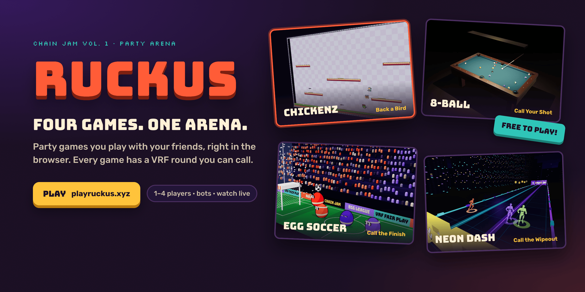
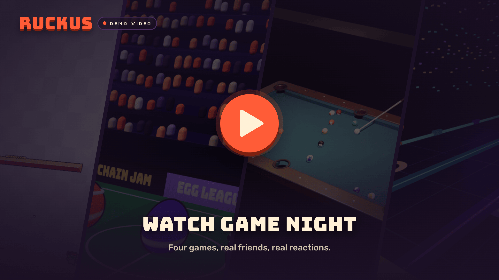
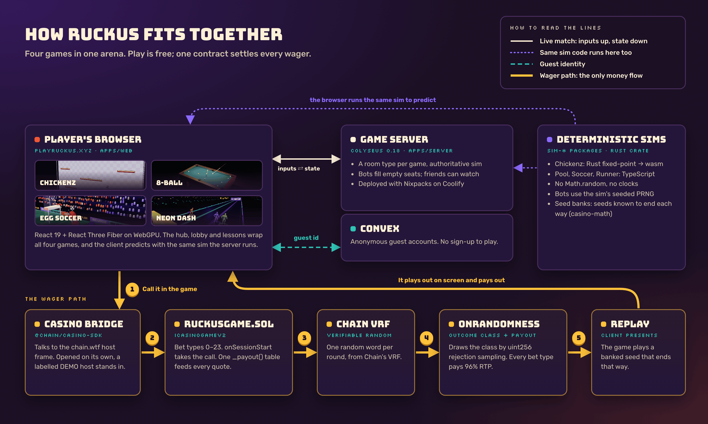

# RUCKUS

[](https://playruckus.xyz)

**RUCKUS is a party arena of four games you play with friends in the browser.** Pick a game, send a link, and you're playing. Nobody around? Bots fill the empty seats. Every game also has one wager you can call, settled on-chain by Chain's VRF.

[**Play it**](https://playruckus.xyz) · [**Watch the demo**](https://playruckus.xyz) · [**How it fits together**](#how-it-fits-together) · [**Check the casino math**](#the-wagers)

Built for [Chain Jam Vol. 1](https://jam.chain.wtf).

## The idea

Game night with friends is the best part of games: the trash talk, the last-second win, "run it back". Phone party games made that easy, but they're one game at a time, one friend at a time, stuck inside a chat app. RUCKUS puts four very different games in one place on the web. Everyone joins from a link, and anyone can watch.

Playing is free. On top of that, each game has one moment you can **call**: back a chicken in a fight, call your pool shot, call how the golden goal ends, call the wipeout. That call is the casino round. The contract draws the outcome from VRF, and the game plays it out on screen.

## The games

| Game | What it is | Players | You can call |
|---|---|---|---|
| **Chickenz** | A pixel platform shooter. Four birds, one arena, last chicken standing. | 2–4 | **Back a Bird**: which bird wins, and how |
| **8-Ball** | 3D pool with real cloth, cushions and spin. Sink your group, then the 8. | 1–2 | **Call Your Shot**: pick a ball and a pocket; harder shots pay more |
| **Egg Soccer** | Head soccer where the players are eggs. 90-second matches, headers and power-ups. | 1–4 | **Call the Finish**: how 20 seconds of golden goal ends |
| **Neon Dash** | A three-lane runner through a neon city. Race your friends' ghosts. | 1–4 | **Call the Wipeout**: which barrier stops the runner, or a clean run |

Every game has bots, online rooms with a join code, watchers, and hands-on lessons that teach the controls on the live game. Neon Dash can also send a "beat my run" link: the course and your inputs are in the URL, and the time is recomputed by replaying them.

<details>
<summary>Controls for each game</summary>

| Game | Keyboard and mouse | Touch |
|---|---|---|
| Chickenz | A/D or ←/→ move · W or ↑ jump · Space or click shoot · S or ↓ taunt (all rebindable) | On-screen stick and buttons |
| 8-Ball | Click or drag the table to aim · ←/→ fine aim · hold Space or drag the cue for power · drag the red dot for spin · V swaps camera | Tap to aim, pull the cue |
| Egg Soccer | A/D or ←/→ move · W, ↑ or Space jump (hold to jump higher) · run into the ball to kick, jump into it to head | On-screen move and JUMP buttons |
| Neon Dash | A/D or ←/→ change lane · W, ↑ or Space jump · hold S or ↓ to slide (in the air: slam down) | Swipe |

</details>

## Watch it

[](https://playruckus.xyz)

The demo video is being cut from a real game night. Until it's up, the thumbnail opens the live site.

## How it fits together

[](docs/assets/readme/architecture.png)

- **Browser** ([apps/web](apps/web)): React 19 and React Three Fiber on WebGPU. One hub holds all four games; starting a match is a camera move, not a page change.
- **Game server** ([apps/server](apps/server)): Colyseus 0.18. Each game has a room type that runs the authoritative sim, fills empty seats with bots and lets friends watch. It deploys with Nixpacks on Coolify ([nixpacks.toml](apps/server/nixpacks.toml)).
- **Deterministic sims** ([packages/sim-pool](packages/sim-pool), [sim-soccer](packages/sim-soccer), [sim-runner](packages/sim-runner), [crates/chickenz-sim](crates/chickenz-sim)): the same code runs on the server and in the browser. They never read a clock or `Math.random`, and bots draw from the sim's own seeded PRNG. Chickenz is Rust fixed-point compiled to wasm.
- **Convex** ([convex](convex)): anonymous guest accounts, so nobody signs up to play.
- **Wager path**: the game talks to the host only through the Chain casino SDK bridge ([packages/casino-bridge](packages/casino-bridge)), and one contract settles every call ([contracts/src/RuckusGame.sol](contracts/src/RuckusGame.sol)).

## The wagers

One contract, `RuckusGame`, implements `ICasinoGameV2` with 24 bet types. **Every bet type returns exactly 96%.** The game never decides an outcome:

1. You make a call in the game. The bridge opens a session with the host, and `onSessionStart` takes the wager.
2. Chain's VRF returns one random word. `onRandomness` turns it into an outcome class by uint256 rejection sampling, never `% n` on raw bytes ([`drawClass`](contracts/src/RuckusGame.sol)).
3. One `_payout()` table feeds `quoteCaps`, `quoteRiskParams`, `onSessionStart` and `onRandomness`, so a quote can't disagree with a payout.
4. The client only *presents* the class. It picks a seed from a precomputed **seed bank** of seeds known to end that way on the real sim, then plays it. Tests replay every bank entry to prove it ends in its class ([seed banks](packages/casino-math/seedbanks)).

| Bet types | Game · call | Pays (top) |
|---|---|---|
| 0 | Chickenz · Back a Bird (flawless win / win / second / lose) | 6× |
| 1–4 | 8-Ball · Call Your Shot: straight, cut, thin, long | 1.28× to 9.6× |
| 5–17 | Egg Soccer · Call the Finish: a side, a shot, a header, off the woodwork, any goal, no goal | 1.2× to 9.6× |
| 18–23 | Neon Dash · Call the Wipeout: any, jump, duck, dodge, strict duck, clean run | 1.2× to 9.6× |

The TypeScript mirror of the tables is [packages/casino-math/src/tables.ts](packages/casino-math/src/tables.ts). Committed parity vectors check that it matches the Solidity payout for every bet type ([contracts/vectors](contracts/vectors), [contracts/test/Parity.t.sol](contracts/test/Parity.t.sol)).

**Why these are new casino games:** each round is built on a real moment from its game. It isn't a dice roll with a skin, and none of them is a classic or a crash, plinko, dice, limbo or mines clone. Each one was checked against the originals on Stake, Roobet, BC.Game, Rollbit and Shuffle.

## Jam requirements, and where each one is met

| Requirement | Where |
|---|---|
| Implements `ICasinoGameV2` exactly | [contracts/src/RuckusGame.sol](contracts/src/RuckusGame.sol), tests in [contracts/test](contracts/test) |
| Frontend talks to the host only through the SDK bridge, with no wallet code | [packages/casino-bridge](packages/casino-bridge), vendored SDK in [packages/chain-casino-sdk](packages/chain-casino-sdk) |
| `game.manifest.json` served same-origin, `gameId: ruckus` | [apps/web/public/game.manifest.json](apps/web/public/game.manifest.json) |
| Outcomes come from VRF only, with unbiased draws | `onRandomness` and `drawClass` in [RuckusGame.sol](contracts/src/RuckusGame.sol) |
| Declared RTP between 93% and 98% | 96% on all 24 bet types: `DECLARED_RTP_BPS` in [tables.ts](packages/casino-math/src/tables.ts), bias and parity tests in [packages/casino-math/test](packages/casino-math/test) |
| Playable standalone, outside the chain.wtf iframe | With no host (or no handshake within ~3 s) a labelled **DEMO credits, no value** host boots: [packages/casino-bridge/src/bridge.ts](packages/casino-bridge/src/bridge.ts) |
| Jam widget, og:image, no frame-blocking headers | [apps/web/index.html](apps/web/index.html), [apps/web/public/og-image.png](apps/web/public/og-image.png) |
| Works in the Chain simulator end to end | Scripted runs for every game's wager, below |

## Run it locally

You need Node 24.12+, pnpm 10 and, for the contract, [Foundry](https://getfoundry.sh). Rust is only needed to rebuild the Chickenz wasm; the built package is committed.

```sh
pnpm install --frozen-lockfile
pnpm dev                      # web on :5173, game server on :2567
```

Open [localhost:5173](http://localhost:5173). Copy [.env.example](.env.example) to `.env.local` to point it at your own Convex deployment and game server.

**The casino loop in the Chain simulator:**

```sh
pnpm -F @arena/contracts sync                   # copy RuckusGame into the simulator
cd casino-sdk && npm install && npm start      # harness on :3300, chain on :8545
# with `pnpm dev` running, in another terminal:
pnpm -F @arena/browser-checks casino            # standalone demo, then bet → VRF → settle → reveal
pnpm -F @arena/browser-checks back-bird         # also: pool-wager, soccer-finish, runner-wipeout
```

**Checks** (the same as CI):

```sh
pnpm verify                   # Biome, TypeScript, Vitest
pnpm -F @arena/contracts test # Foundry
pnpm -F @arena/web build && pnpm -F @arena/web budgets
```

The tests cover what can quietly go wrong: RTP and payout parity, unbiased class draws, seed banks replaying to their class, sim and bot determinism, and netcode. There are no UI tests.

## Find your way around

| Looking for | Start here |
|---|---|
| The hub, lobby and the four games' rendering and HUD | [apps/web/src](apps/web/src) (`games/<game>` never import each other) |
| Game rules, physics and bots | [packages/sim-*](packages), [crates/chickenz-sim](crates/chickenz-sim) |
| Rooms and matchmaking | [apps/server/src/rooms](apps/server/src/rooms) |
| The contract and its tests | [contracts](contracts) |
| Payout tables, VRF draw mirror, seed banks | [packages/casino-math](packages/casino-math) |
| Brand colours and type | [apps/web/src/styles/tokens.css](apps/web/src/styles/tokens.css) |
| A plain-text index for automated readers | [llms.txt](llms.txt) |

## Credits

RUCKUS stands on open work: the original [Chickenz](https://github.com/AshFrancis/chickenz) (MIT), [pooltool](https://github.com/ekiefl/pooltool)'s physics models (Apache-2.0), [KaspaKinesis](https://github.com/peavey2787/KaspaKinesis)' runner rules (MIT), Pixel Frog and Quaternius art (CC0), and sound and music made with ElevenLabs. Their notices ship with the code that uses them ([crates/chickenz-sim/NOTICE](crates/chickenz-sim/NOTICE), [packages/sim-pool/NOTICE](packages/sim-pool/NOTICE)).

Made by **Abubakr Jimoh**. [MIT licensed](LICENSE); third-party material keeps its own terms.
